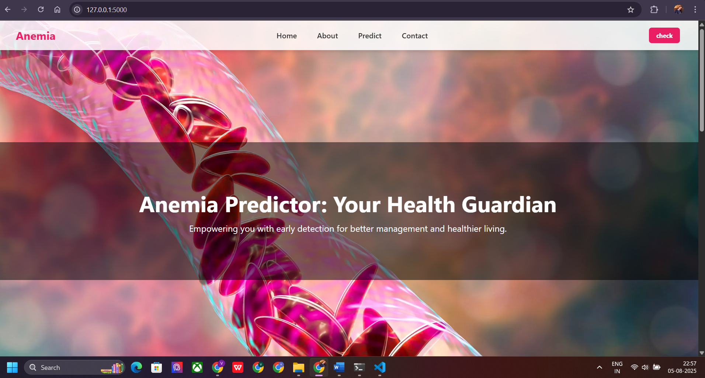
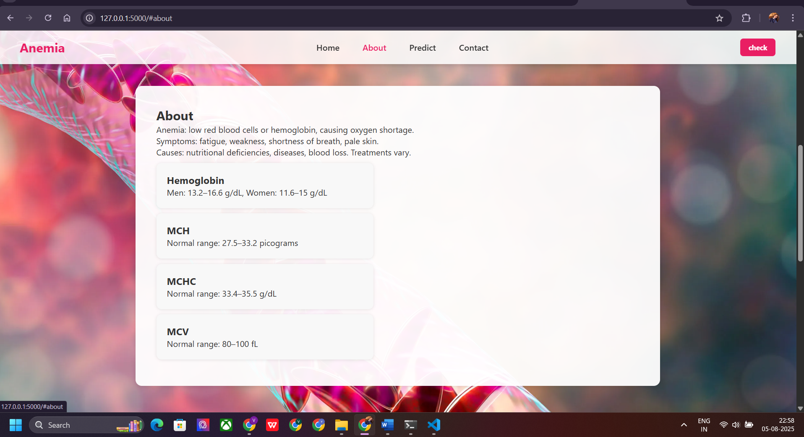
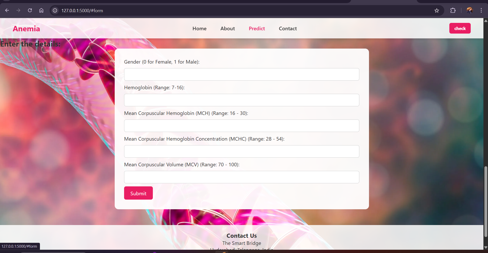
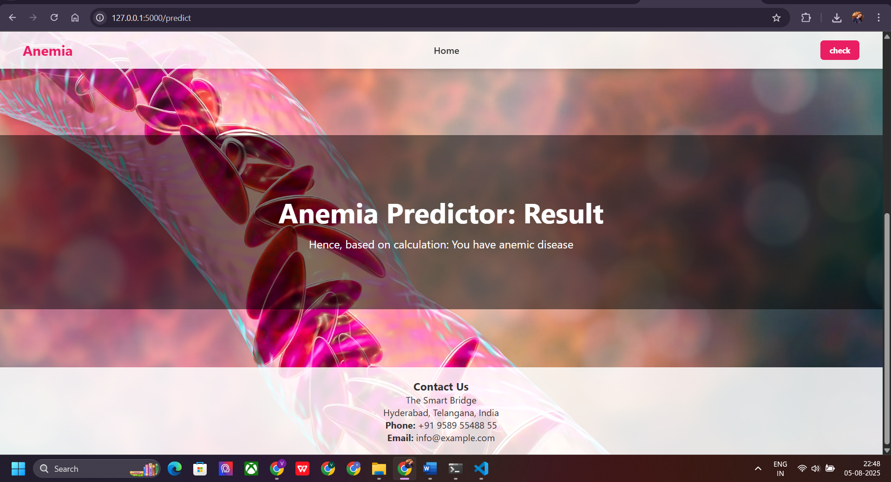

# AnemiaSense-AI

An AI-powered anemia prediction web application using Python, Flask, and Machine Learning.  
This project was developed as part of the **Smart Internz Internship** by **Vartika Singh**.

---

## 💡 Project Summary

**AnemiaSense** is a lightweight AI-based diagnostic tool that predicts anemia in individuals using basic clinical parameters like age, gender, hemoglobin level, and red blood cell count.  
It features a user-friendly web interface and a Flask backend integrated with a trained machine learning model.

---

## 📂 Folder Structure
AnemiaSense-AI/
├── app.py # Flask backend application
├── model.pkl # Trained ML model (Pickled)
├── requirements.txt # Python dependencies
├── templates/
│ └── index.html # Frontend input form
├── static/
│ └── style.css # Styling (optional)
├── dataset/
│ └── anemia-dataset.csv # Original dataset from Kaggle
├── screenshots/
│ ├── homepage.png # Web interface screenshot
│ ├── result.png # Prediction result screenshot
│ └── architecture.png # System architecture DFD
├── documentation/
│ └── AnemiaSense_Project_Report_Vartika.docx # Final project report
└── demo/
└── AnemiaSense_Demo.mp4 # Project demonstration video

---

## 🔧 Technologies Used

- Python  
- Flask  
- HTML, CSS  
- Scikit-learn  
- Pandas, NumPy  
- Pickle  
- Kaggle Dataset

---

## 📸 Screenshots

  
*Home page input form*

  
*About page*

  
*Prediction page input form*

  
*Output after prediction*

---

## 🧠 Dataset

Dataset used from Kaggle:  
**[Anemia Dataset by Biswaranjan Rao](https://www.kaggle.com/datasets/biswaranjanrao/anemia-dataset)**

---

## ▶️ Demo Video

📽️ [Watch Demo](AnemiaSense_DemoVartika.mp4) 

---

## 🧾 Project Documentation

Full project report included in `VartikaSinghProjectReport`.

---

## 🙏 Acknowledgment

This project was completed as part of the **Smart Internz Internship**, with guidance from mentor **Shiva Charan**.

---

## 📩 Contact

**Vartika Singh**  
B.Tech CSE (AI & ML), School of Management Sciences, Lucknow  
📧 Email: vartika.singh.2004lko@gmail.com

